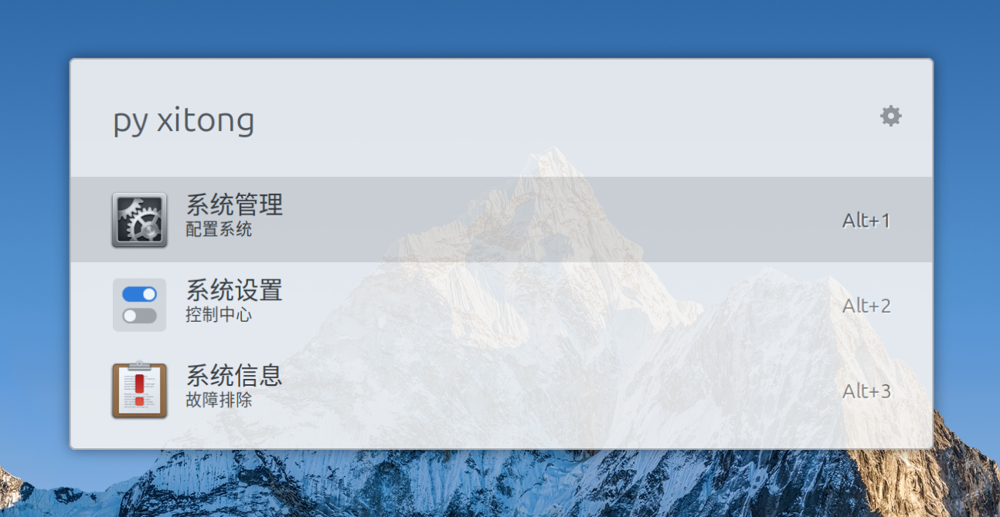

# Ulauncher Pinyin

A Ulauncher extension that lets you search Chinese desktop applications by pinyin.

For example:

- `py xitong` -> `系统`
- `py xt` -> `系统`
- `py lanxin` -> `蓝信`

## Screenshot



## Features

- Searches app names by original Chinese text, full pinyin, and initials
- Scans standard Linux `.desktop` application directories
- Works with localized desktop entry names such as `Name[zh_CN]`
- Bundles its own pinyin mapping instead of depending on external Python packages
- Includes targeted regression coverage for common Chinese app-name cases

## Requirements

- Ulauncher 5+
- Ulauncher extension API v2
- A Linux desktop environment with `.desktop` application entries

## Install

In Ulauncher:

1. Open `Preferences -> Extensions`
2. Add this GitHub repository URL: `https://github.com/lester2pastm/ulauncher-pinyin`
3. Enable the extension

For local development, symlink the project into:

```bash
~/.local/share/ulauncher/extensions/ulauncher-pinyin
```

## Usage

The default keyword is `py`.

Examples:

- `py xitong`
- `py xt`
- `py wangyiyunyinyue`

Select a result to launch the application.

## How It Works

- Loads desktop applications from common Linux application directories
- Builds an in-memory search index when the extension starts
- Converts Chinese app names into full pinyin and initials
- Returns Ulauncher results ranked by exact match, prefix match, and fallback substring match

## Project Structure

- `main.py` - Ulauncher extension entry point, desktop app loading, and search ranking
- `pinyin_data.py` - bundled pinyin mapping and phrase overrides
- `manifest.json` - Ulauncher extension metadata
- `versions.json` - API-version mapping for Ulauncher extension distribution
- `images/icon.png` - extension icon
- `tests/` - focused regression tests for parsing, matching, and pinyin conversion

## Development Notes

The project intentionally keeps the implementation lightweight and dependency-free for distribution through Ulauncher.

Test execution depends on the local environment. In this workspace, `pytest` is not installed, so verification has been performed with focused Python regression scripts plus LSP diagnostics.

## Limitations

- This does not replace Ulauncher's built-in app search
- Queries must use the extension keyword
- Pinyin quality depends on the bundled mapping table and phrase overrides

## License

MIT. See `LICENSE`.
